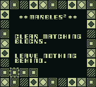
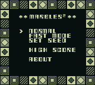
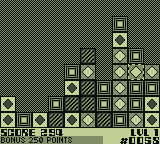
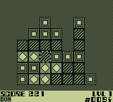
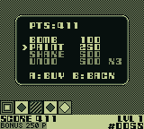
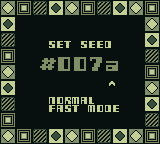
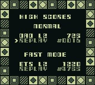

# Marbles² — Player Guide

A Game Boy puzzler where you clear a board of coloured marbles by flooding
groups of touching same-colour blocks. Empty the grid, beat the timer, rack
up a high score, and keep your run alive with a small in-game economy of
bombs, paint, and undos.

---

## The main menu

Five options, d-pad up/down to move the cursor, A or START to select:

- **NORMAL** — the main game (10×8 grid, four block types).
- **FAST MODE** — a smaller, faster variant (7×7 grid, three block types).
- **SET SEED** — type in a four-digit hex seed to play a specific board.
- **HIGH SCORE** — view the top score per mode and replay it with one button.
- **ABOUT** — credits.

The cursor remembers where you left it, so popping into HIGH SCORE or ABOUT
and pressing B drops you back on the same menu item.

---

## Game modes

### NORMAL

- **Grid:** 10 columns × 8 rows, four block types (plain, ringed, diamond, striped).
- **Bag dealer:** every board is dealt from a Fisher-Yates-shuffled bag of exactly 20 of each block type — so you always get the same distribution, just in a different layout.
- **Bonus timer:** 30 seconds (1,800 frames). The "BONUS POINTS" bar across the bottom drains left-to-right.
- **Undo:** 3 free undos per level, pushed automatically before every clear and every bomb/paint. Press **B** to pop one. You can refill the credit pool in the STORE.
- **Store:** available via **SELECT** during play, or from the PAUSE menu, or when the "NO MOVES LEFT" lifeline fires.
- **Lifeline:** if you run out of moves but have enough points to buy *anything*, the game offers you one last trip to the store before it's over.

### FAST MODE

- **Grid:** 7 columns × 7 rows, only three block types.
- **Bag dealer:** purely random per cell (no shuffled bag) — every cell is rolled independently.
- **Bonus timer:** 10 seconds (600 frames). Much tighter than NORMAL.
- **Undo:** none.
- **Store:** none.
- **Lifeline:** none — no moves, game over.
- **Vibe:** a pure reflex score attack. No safety nets. Fewer colours means bigger groups and bigger payouts, but also more likely to strand you.

### Side-by-side

| Feature        | NORMAL                       | FAST MODE          |
| -------------- | ---------------------------- | ------------------ |
| Grid           | 10 × 8                       | 7 × 7              |
| Block types    | 4                            | 3                  |
| Bonus timer    | 30 s                         | 10 s               |
| Undo           | 3 per level (refillable)     | ✗                  |
| Store          | ✓                            | ✗                  |
| Lifeline       | ✓                            | ✗                  |
| Seed display   | Pause screen + bonus bar     | Pause + bonus bar  |
| High score     | Separate NORMAL leaderboard  | Separate FAST leaderboard |

---

## How to play

1. **Move the cursor** with the d-pad (with auto-repeat if you hold).
2. **Press A** over a block to flood-fill its connected group. If the group has **2 or more** blocks, they all clear at once. A single isolated block is not clearable.
3. **Gravity** drops the surviving blocks down into the empty space.
4. **Compaction** then shifts whole empty columns to the left so there are no gaps.
5. **Score** for a clear of `n` blocks is `n × n`. Bigger groups scale super-linearly — a 10-clear (100 pts) is worth more than two 5-clears (25 + 25 = 50).
6. **Level clear bonus:** clearing the entire board with bonus timer still running gives **+250 pts**.

Press **START** to pause at any time.

---

## The STORE (NORMAL only)

Open with **SELECT** during play, or from the **PAUSE → STORE** menu item, or via the **NO MOVES LEFT** lifeline.

While the store is open or an item is armed, the bonus timer is paused so you can think.

### Items

| Item     | 1st buy     | 2nd buy     | 3rd+ buys   | What it does                                                       |
| -------- | ----------- | ----------- | ----------- | ------------------------------------------------------------------ |
| **BOMB** | **100** pts | **250** pts | 500 pts     | Clear one single cell (ignores the "minimum group of 2" rule)      |
| **PAINT**| 250 pts     | 250 pts     | 250 pts     | Recolour one cell — great for connecting two almost-matching groups |
| **SHAKE**| 500 pts     | 500 pts     | 500 pts     | Fisher-Yates reshuffle every remaining block on the board          |
| **UNDO** | 500 pts     | 500 pts     | 500 pts     | Refill one undo credit (capped at 3 held)                          |

**BOMB** uses a three-tier price ramp per game: 100 pts for your first buy, 250 pts for the second, and 500 pts from the third onward.

The hint line at the bottom of the store shows **A:BUY** when you don't own any of the highlighted item, and **A:USE** when you have at least one in your inventory. Bought items with a nonzero count show an `X N` suffix (e.g. `BOMB 500 X2` means you currently hold two bombs).

Unaffordable items are rendered dim. If you hold an item already, the row stays bright because the "USE" action is free.

### Using armed items

When you buy or select BOMB or PAINT, the cursor changes to a thick frame to show you're "armed". Move with the d-pad to target a cell, then:

- **BOMB** — A obliterates just that one cell. Great for breaking up a stuck single-block island.
- **PAINT** — A selects the cell, then the d-pad **cycles the colour in place** (right/down = next colour, left/up = previous). A second A press commits the new colour. B reverts it without spending the paint.

**B at any time** cancels an armed item. If cancelling leaves the board with no moves, the game ends — there's no infinite "arm and cancel" trick to stall out.

### SHAKE

SHAKE is applied immediately — no targeting step. Every remaining block is scattered into a new random layout, the board settles with gravity+compaction, and play resumes. Useful when you're stuck but the board still has most of its blocks.

### UNDO (refill)

UNDO doesn't trigger an undo directly — it refills one undo credit into your pool, up to the cap of 3 held. Press B on the board to actually spend a credit and rewind.

---

## Seeds

Every board is generated from a 16-bit **seed** shown as `#NNNN` in lowercase hex. Same seed → same board (same level progression, same dealt bag order).

You can see your current seed in two places:

### On the bonus bar

As the bonus timer drains right-to-left, the seed (`#NNNN`) is gradually revealed underneath it. Race the timer to deny your opponent a peek.

### On the pause screen

Press **START** mid-game. The pause overlay shows `SEED #NNNN` and offers RESUME, STORE (NORMAL only), RESTART (replays the same seed), and QUIT.

### Entering a seed manually

From the main menu, **SET SEED** opens a 4-digit hex entry screen. You pick NORMAL or FAST, type the seed, and press START to play. Useful for sharing boards with friends (`"try #007A on NORMAL"`) or rerunning a run that went well.

Seed `0000` is silently replaced with `0001` — the xorshift PRNG can't advance from zero.

### Why seeds matter

- **Replay a run you liked** — hit RESTART from pause, or enter the seed from the menu.
- **Share boards** — same seed + mode = identical layout on any copy of the game.
- **Challenge runs** — pick a specific seed and try to beat your own score on it.
- **High score replays** — the high score screen remembers the seed and lets you replay it directly.

---

## High scores

- **One entry per mode** (NORMAL and FAST have independent leaderboards).
- **Saved to cartridge SRAM** — battery-backed, survives power off. A fresh cart shows `???  0` for both entries.
- **When you beat the current high score**, a "NEW HIGH SCORE" banner slides up on the window layer during play. Your eventual final score is checked against the saved entry on game over, and if it still qualifies you're asked to enter your initials (three letters).
- **The entry stores**: your initials, the final score, the seed you played, and the level you reached.
- **Replay a high score**: from the high score table screen, pick an entry and press A to start a new game on that seed in the matching mode. Your score resets but the board layout is identical — a good way to learn from a strong run.

---

## Tips

- **Bigger groups, more points**: a single clear of 8 is worth `8 × 8 = 64` pts, while two clears of 4 are worth `2 × 16 = 32` pts for the same blocks. Patience beats twitch.
- **Clear small isolated groups last**: gravity and compaction can merge bigger groups together if you clear surrounding blocks first.
- **Race the timer on NORMAL**: +250 pts for level clearing with time left is a nice bonus that rewards quick play.
- **Save your first bomb**: at 100 pts it's basically free. The second one doubles to 250, and everything after that is 500 — so pick spots that really unlock the board.
- **Paint is underrated**: two adjacent 2-cell groups of different colours turn into a 4-cell group worth `16` pts instead of `2 × 4 = 8` pts — and you break up whatever was blocking the connection.
- **SHAKE is an emergency tool**: 500 pts is a lot, but it's also "still playing" vs "game over".
- **Undo refills stack**: if you blow all three undos and still have points, buy a refill from the store and keep rewinding.

---

## Controls reference

| Button | Gameplay                         | Menus                          |
| ------ | -------------------------------- | ------------------------------ |
| D-pad  | Move cursor / paint-cycle colour | Move cursor                    |
| A      | Clear group / use armed item     | Select                         |
| B      | Undo (NORMAL) / cancel armed     | Back                           |
| START  | Pause menu                       | Select (on main menu)          |
| SELECT | Open STORE (NORMAL)              | Cycle cursor down (on pause)   |

---

*Marbles² is a Game Boy port of a Palm Pilot game originally written in 2002.
Fonts by DamienG.com. Written by Remy Sharp — more at remysharp.com.*
